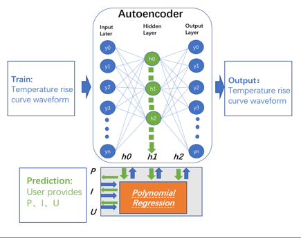
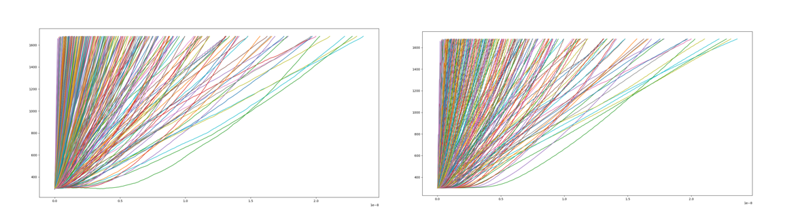

# 基于卷积autoencoder的PIN二极管温升曲线预测

### 在TCAD下仿真得到不同的PIN二极管结构参数对应的微波脉冲下的温度上升时间曲线趋势
### 需要建模有参数（P,I,N层厚度)预测其温度生成曲线
### 这是一个低维到高维的映射变换，难以直接建模，故我们采用autoencoder的压缩方法
### 先将温度上升曲线压缩为低维向量，再将低维向量和PIN二极管参数之间建模映射关系，只使用解码器部分即可完成预测

## 模型结构

## 预测结果

